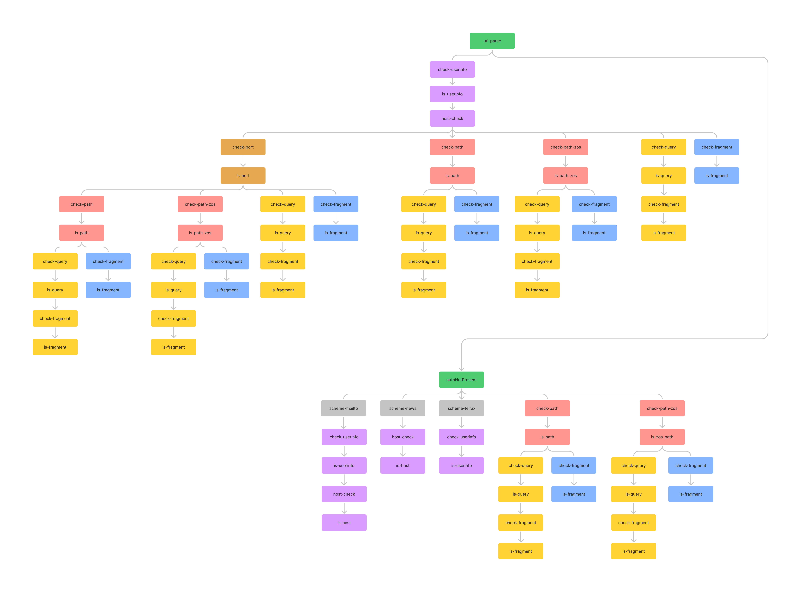

# Lisp Uri Parser

## How parsing happens

Parsing occurs in sequence. Scheme, userinfo, host, port, path, query and fragment are divided according to the characters that distinguish them: ':', '@', '/', '?', '#' Specifically, at each step the lisp program splits the list in the presence of the above characters into two parts: one part on the left and one part on the right.
Then the characters that make up the left part are checked according to the specification. If they are valid, the next step (function) is identified based on the specific characters, the left part is assigned to its field and the right part is passed to the next function which contains all the rest of the uri.

Example:  
Let's suppose we have this uri:  
`"https://host"`
The first step will be to divide the scheme with the ':' char:  
`"https:"` - `"//host"`
Given the presence of '//' it will proceed to control the authority. Since the authority composed of `userinfo`, `host` and `port` the first function called will be `check-userinfo` that will set the `userinfo` field as `NIL`. Only after this the function `cehck-host` will be called to divide and set the host field. All the other fields will be set to `NIL` since the list is empty after the host.

Chart of function called:

